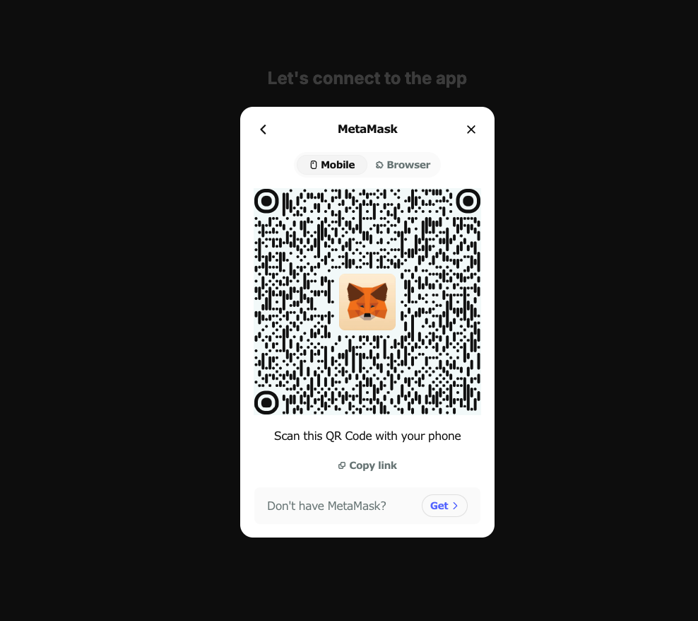

<p align="center">
  
</p>

# AppKit

With a layered feature stack spanning onboarding to transactions, messaging and more, AppKit enables apps to build powerful top-to-bottom web3 experiences made to last, all through one seamless integration.

## Getting Started

Download the repo:

```bash
npm install
npm run dev
# or
yarn dev
# or
pnpm dev
# or
bun dev
<p align="center">
  
</p>
<p align="center">
  
</p>
<p align="center">
  
</p>
<p align="center">
  
</p>
```