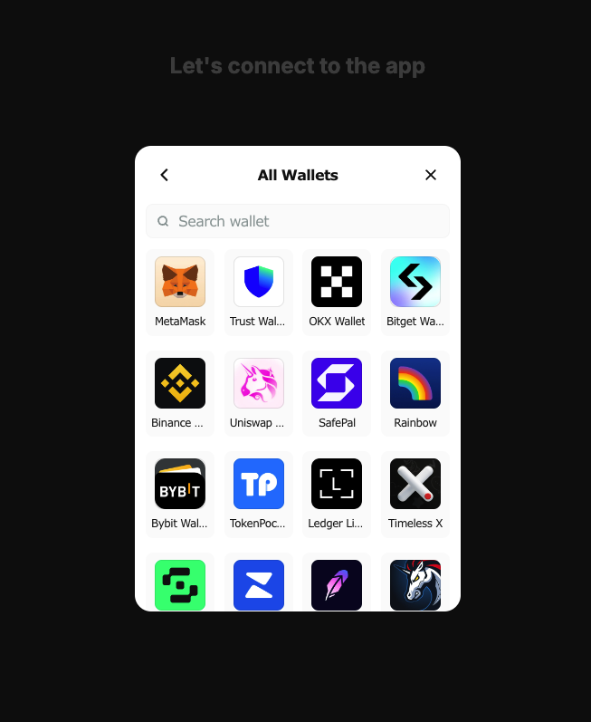

<p align="center">
  
</p>

# AppKit

WalletConnect is a platform that provides developers with tools to create seamless, secure, and scalable user experiences for Web3 applications and wallets. It offers a suite of SDKs and APIs, including AppKit for building powerful apps and WalletKit for enhancing wallet experiences. The platform facilitates easy integration with over 6,000 apps and 150+ blockchains, aiming to enhance digital ownership through intuitive and modular solutions. WalletConnect also provides analytics and UX insights to help developers optimize their products.

## Getting Started

Download the repo:

```bash
npm install
npm run dev
# or
yarn dev
# or
pnpm dev
# or
bun dev

```
<p align="center">
  
</p>
<p align="center">
  
</p>
<p align="center">
  
</p>

<p align="center">
  
</p>